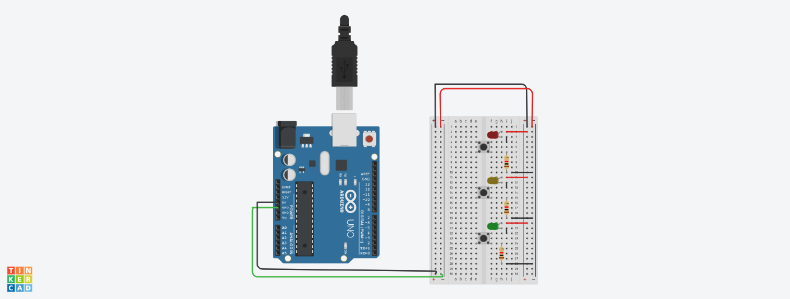

# Arduino LED Button Control 

This project simulates controlling 3 LEDs using 3 push buttons with an Arduino UNO, designed and tested in Tinkercad Circuits.
The buttons are connected between 5V and the digital pins and use (INPUT_PULLUP) mode, which inverts the logic:
- Pressed = LOW → LED ON
- Not pressed = HIGH → LED OFF

#  Circuit Diagram

# Tinkercad Simulation Link

[Click here to view and simulate the project in Tinkercad](https://www.tinkercad.com/things/cWJYEBW5x54-arduino-led-button-?sharecode=iYpS6MTcJQxjhWR2OX4HlnA5KyGOmfdTQwnhvjaN5rs)

